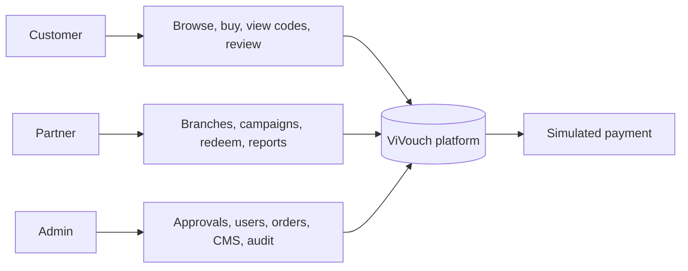

# Use-case Diagram

## System boundary

The platform owns authentication, catalog, inventory, orders, code issuance, code usage, content, and reporting. Payment delivery, email/SMS, and QR scanning hardware remain simulated external services.

## Actor goals

- Customer: discover a valid offer, purchase it safely, receive proof of entitlement, use it, and provide feedback.
- Partner: maintain business locations and campaigns, validate an entitlement without consuming it, confirm usage, and measure performance.
- Admin: control identities and lifecycle approvals, resolve/cancel orders, publish content, and inspect traceable system activity.
