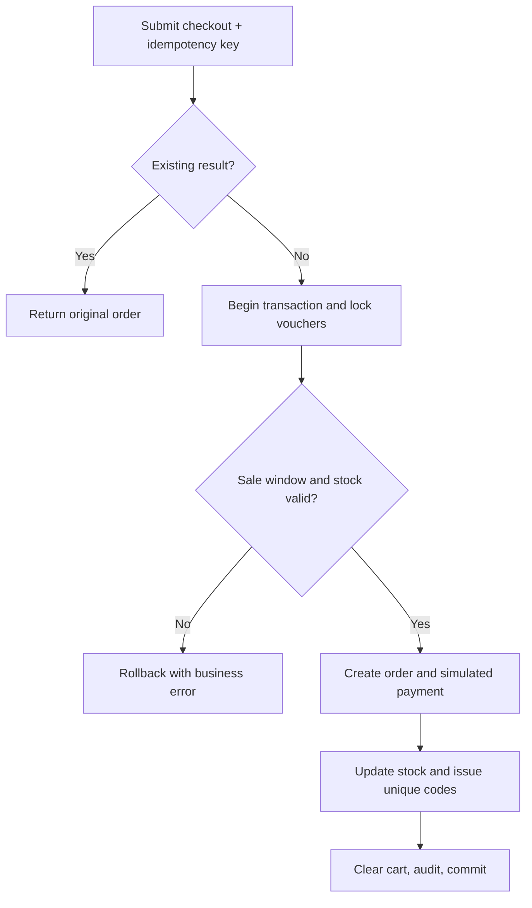
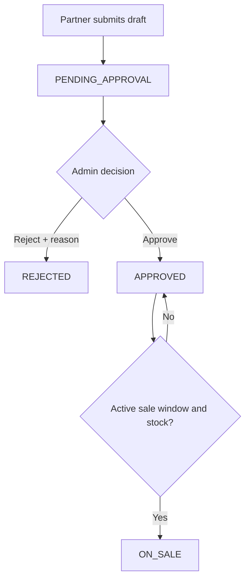
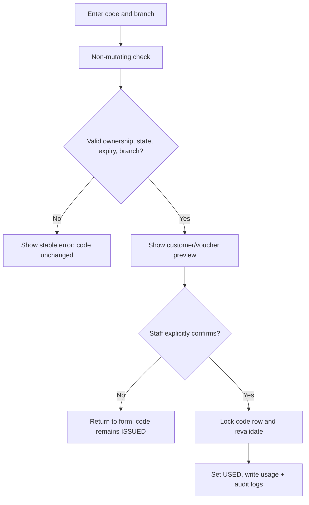

# Activity Diagrams

## Checkout

```mermaid
flowchart TD
  A[Submit checkout + idempotency key] --> B{Existing result?}
  B -- Yes --> C[Return original order]
  B -- No --> D[Begin transaction and lock vouchers]
  D --> E{Sale window and stock valid?}
  E -- No --> F[Rollback with business error]
  E -- Yes --> G[Create order and simulated payment]
  G --> H[Update stock and issue unique codes]
  H --> I[Clear cart, audit, commit]
```

## Voucher approval

```mermaid
flowchart TD
  A[Partner submits draft] --> B[PENDING_APPROVAL]
  B --> C{Admin decision}
  C -- Reject + reason --> D[REJECTED]
  C -- Approve --> E[APPROVED]
  E --> F{Active sale window and stock?}
  F -- Yes --> G[ON_SALE]
  F -- No --> E
```

## Two-step redemption

```mermaid
flowchart TD
  A[Enter code and branch] --> B[Non-mutating check]
  B --> C{Valid ownership, state, expiry, branch?}
  C -- No --> D[Show stable error; code unchanged]
  C -- Yes --> E[Show customer/voucher preview]
  E --> F{Staff explicitly confirms?}
  F -- No --> G[Return to form; code remains ISSUED]
  F -- Yes --> H[Lock code row and revalidate]
  H --> I[Set USED, write usage + audit logs]
```
