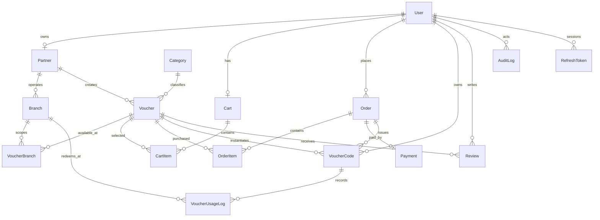

# Entity–Relationship Design

`Banner` and `CmsPage` are independent admin-managed content aggregates.

## Key integrity constraints

- Unique: user email/phone, partner tax code, category name/slug, voucher code, CMS slug.
- Compound unique: partner/title, partner/branch name, cart/voucher, user/voucher review, user/idempotency key.
- Foreign keys preserve ownership across orders, codes, usages, and reviews.
- Indexed lifecycle fields support catalog, admin, and report queries.
- A `VoucherBranch` join table explicitly scopes where a campaign can be redeemed.

The Prisma source of truth is `backend/prisma/schema.prisma`; migrations provide reproducible database creation.
