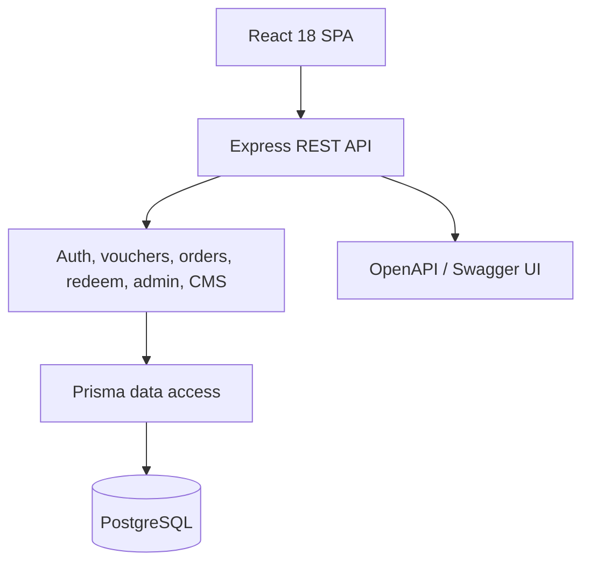

# Architecture Overview

ViVouch is a JavaScript modular monolith with independently deployable frontend and backend processes.

## Frontend

- React 18, React Router 6, TanStack Query, Zustand, Tailwind/DaisyUI.
- Public, Customer, Partner, and Admin route groups.
- Route-level lazy loading keeps the main bundle below the release warning threshold.
- API state stays in TanStack Query; authentication state stays in a small persisted store.

## Backend

- Express modular monolith with route → validation/controller → service → Prisma layers.
- Zod validates external input.
- JWT access tokens, rotating refresh tokens, RBAC middleware, and request-scoped audit context.
- Domain transactions protect checkout, redemption, cancellation/refund, and reviews.

## Data

- PostgreSQL provides relational constraints, atomic transactions, and row-level locks.
- Prisma schema and ordered migrations are the database source of truth.
- Seed data supports all three portals and major lifecycle statuses.

External payment and message delivery remain simulated adapters so they can later be replaced without changing domain rules.
